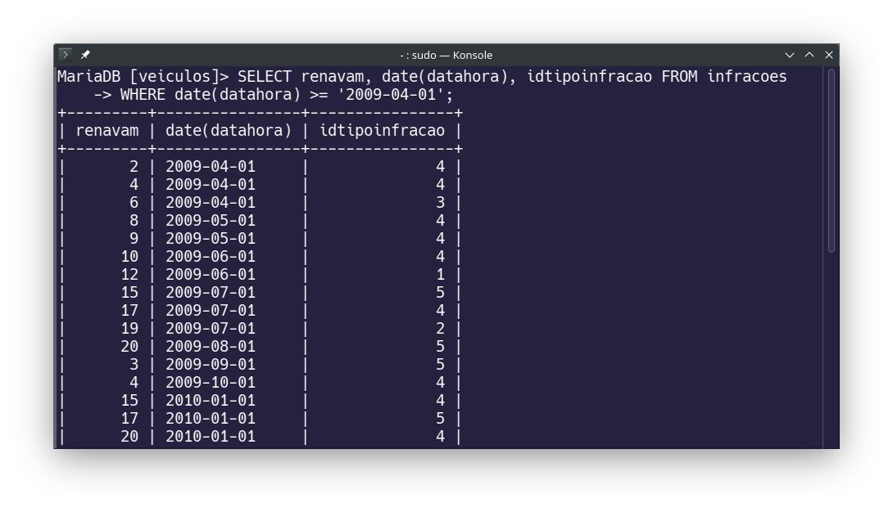
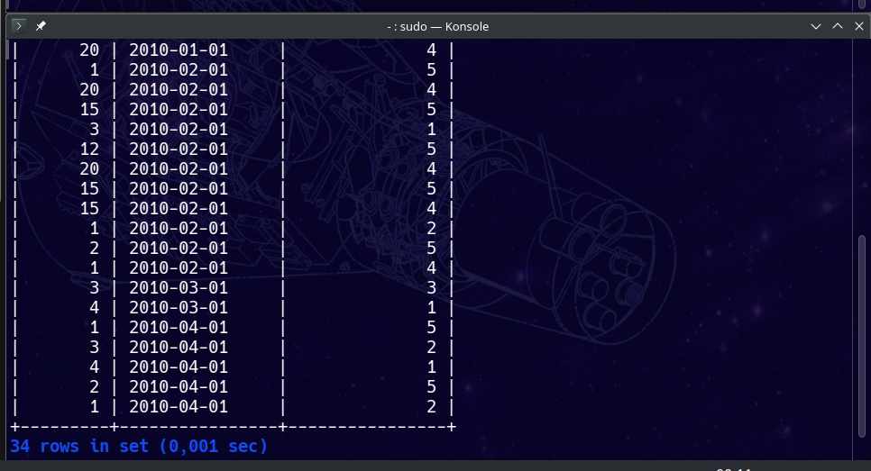

# SQL - Atividade 1
## Aluno: Victor Hugo Santos Bitencourt

- [x] Crie as tabelas usando o script enviado (não precisa enviar este, pois vai usar o disponibilizado no Teams)

---

- [x] 6) Insira registros em algumas tabelas.

```sql
INSERT INTO agentes (nome, datacontratacao) 
VALUES ('Matheus', '2001-04-04');

INSERT INTO cidades (nome, idestado) 
values ('Camacari', 1);

INSERT INTO marcas (nome) 
VALUES ('koenigsegg');
```


---

- [x] 7) Altere em combustível o registro onde nome ="alcool" para nome="álcool". (ou vice-versa) 

```sql
UPDATE combustiveis 
SET nome = 'Alcool' 
WHERE nome LIKE '%lcool';
```


---

- [x] 8) Liste o nome dos modelos da marca 3.

```sql
SELECT * FROM modelos 
WHERE idmarca = 3;
```


---

- [x] 9) Liste o renavam, data e tipo_infracao das infrações que ocorreram a partir do dia 01/04/2009. 

```sql
SELECT renavam, date(datahora), idtipoinfracao FROM infracoes 
WHERE date(datahora) >= '2009-04-01';
```





---

- [x] 10) Liste o renavam e data das infrações que ocorreram a partir do dia 01/04/2009 e tipo de infração igual a 5. 

```sql
SELECT renavam, date(datahora) FROM infracoes 
WHERE date(datahora) >= '2009-04-01' AND idtipoinfracao = 5;
```


---

- [x] 11) Liste o renavam e data das infrações que ocorreram entre os dias 01/03/2009 e 31/03/2009 e tipo de infração igual a 5 

```sql
SELECT renavam, date(datahora) FROM infracoes 
WHERE date(datahora) >= '2009-03-01' 
AND date(datahora) <= '2009-03-31';
```


---

- [x] 12) Exiba placa, idmodelo e idcor dos veículos que a placa começa com JRO. 

```sql
SELECT placa, idmodelo, idcor 
FROM veiculos 
WHERE placa LIKE 'JRO%';
```


---

- [x] 13) Exiba placa, idmodelo e idcor dos veículos que a placa tem o terceiro dígito Z e termina com 9. 

```sql
SELECT placa, idmodelo, idcor 
FROM veiculos 
WHERE placa LIKE '__Z%' 
AND placa LIKE '%9';
```


