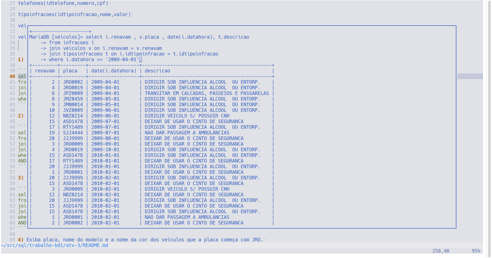
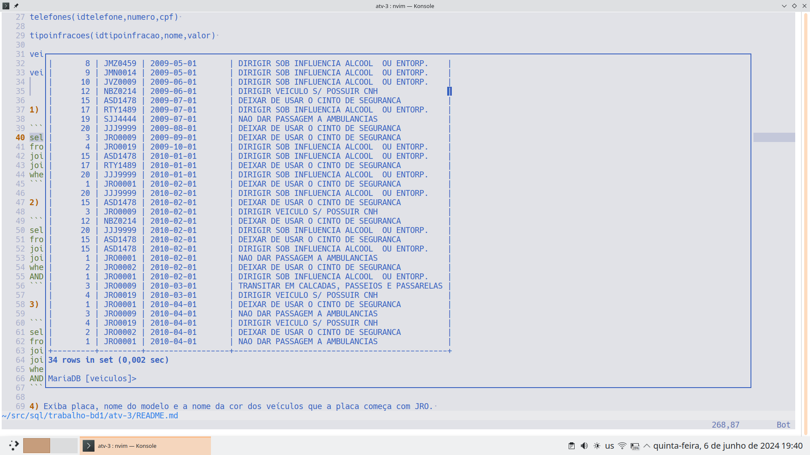
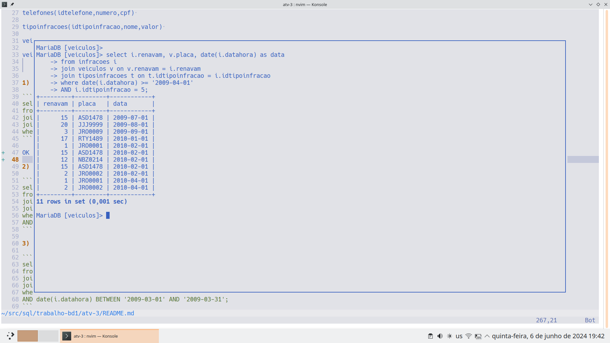
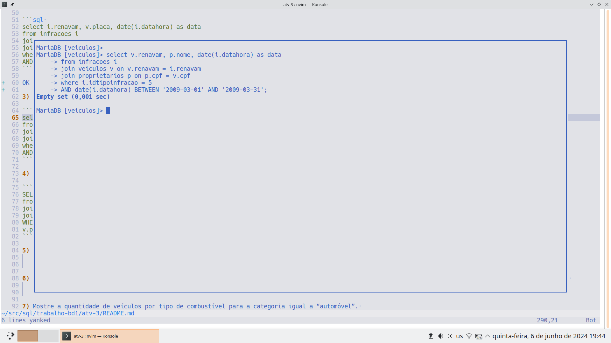
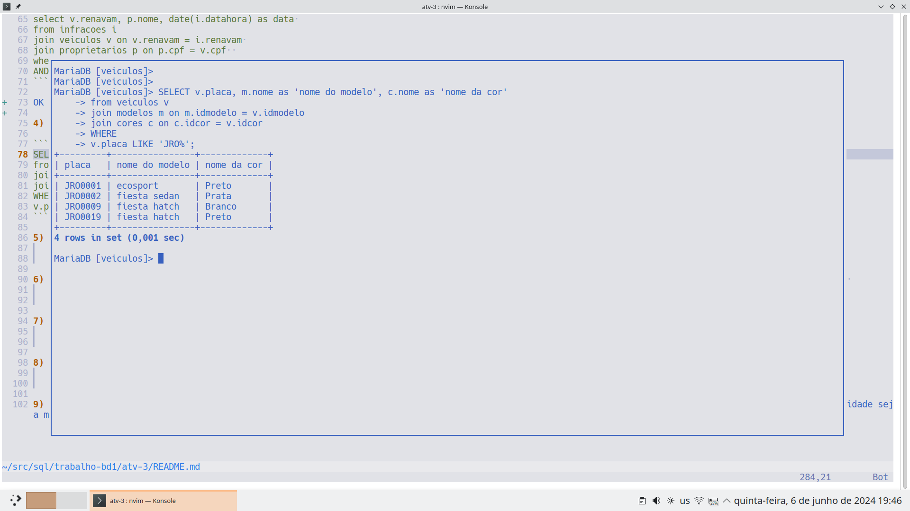
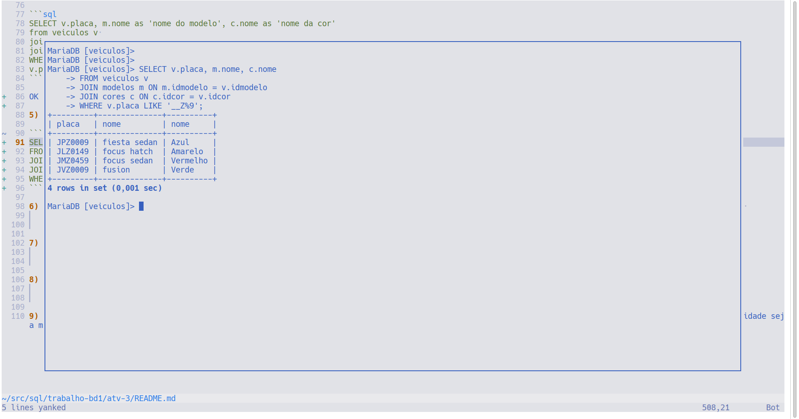
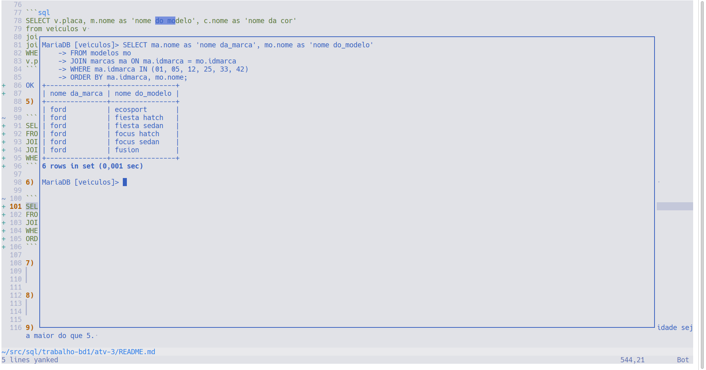
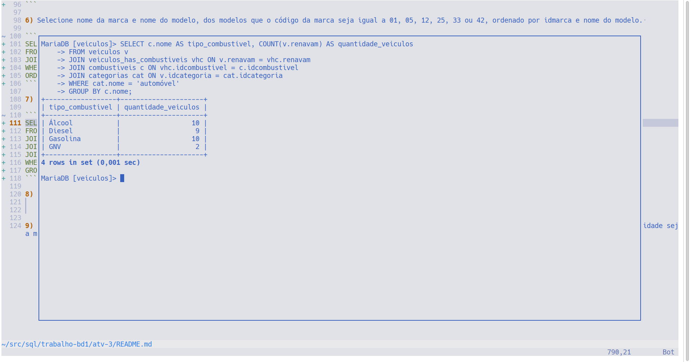
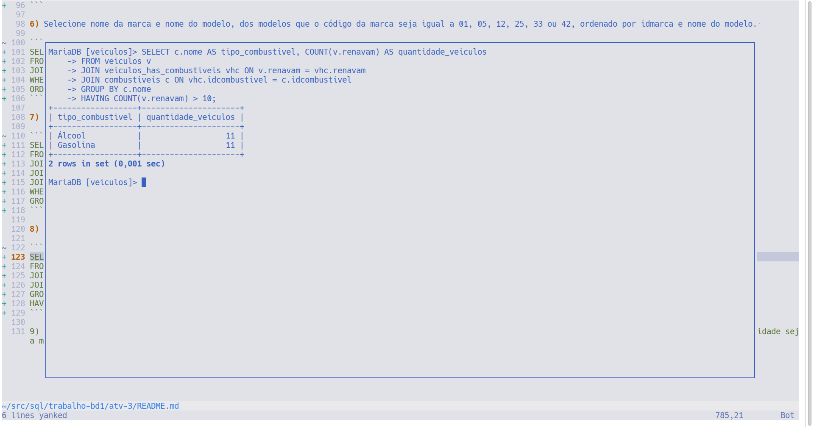
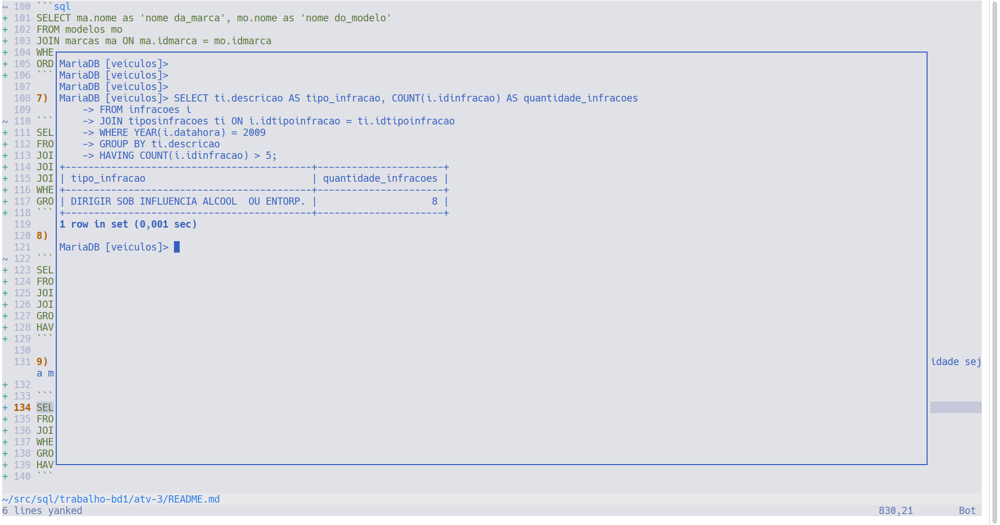

# ALUNO: VICTOR HUGO SANTOS BITENCOURT

Postem o arquivo com o SQL e print da execução.

Faça os exercícios baseando-se nas tabelas abaixo: 

 

agentes(idagente,nome,datacontratacao) 

categorias(idcategoria,nome) 

cidades(idcidade,nome,idestado) 

combustiveis(idcombustivel,nome) 

cores(idcor,nome) 

estados(idestado,nome,sigla) 

infracoes(idinfracao,renavam,data,hora,local,idtipoinfracao,velocidade,idagente,obs) 

marcas(idmarca,nome) 

modelos(idmodelo,nome,idmarca) 

proprietarios(cpf,nome,endereco,idcidade,cep,sexo,data_nasc) 

telefones(idtelefone,numero,cpf) 

tipoinfracoes(idtipoinfracao,nome,valor) 

veiculos(renavam,chassi,placa,idcor,idmodelo,ano_fab,ano_modelo,idcategoria,cpf) 

veiculos_has_combustiveis(renavam, idcombustivel) 

--- 

1) Liste o renavam, a placa do veículo, data e nome do tipo de infracao das infrações que ocorreram a partir do dia 01/04/2009. 

```sql
select i.renavam , v.placa , date(i.datahora), t.descricao
from infracoes i
join veiculos v on i.renavam = v.renavam
join tiposinfracoes t on i.idtipoinfracao = t.idtipoinfracao 
where i.datahora >= '2009-04-01';
```





2) Liste o renavam, a placa do veículo e data das infrações que ocorreram a partir do dia 01/04/2009 e tipo de infração igual a 5. 

```sql 
select i.renavam, v.placa, date(i.datahora) as data
from infracoes i
join veiculos v on v.renavam = i.renavam 
join tiposinfracoes t on t.idtipoinfracao = i.idtipoinfracao
where date(i.datahora) >= '2009-04-01'
AND i.idtipoinfracao = 5;
```



3) Liste o renavam, o nome do proprietário e data das infrações que ocorreram entre os dias 01/03/2009 e 31/03/2009 e tipo de infração igual a 5 

```sql
select v.renavam, p.nome, date(i.datahora) as data 
from infracoes i
join veiculos v on v.renavam = i.renavam 
join proprietarios p on p.cpf = v.cpf  
where i.idtipoinfracao = 5
AND date(i.datahora) BETWEEN '2009-03-01' AND '2009-03-31';
```



4) Exiba placa, nome do modelo e a nome da cor dos veículos que a placa começa com JRO. 

```sql
SELECT v.placa, m.nome as 'nome do modelo', c.nome as 'nome da cor'
from veiculos v 
join modelos m on m.idmodelo = v.idmodelo 
join cores c on c.idcor = v.idcor 
WHERE
v.placa LIKE 'JRO%';
```



5) Exiba placa, nome do modelo e a nome da cor dos veículos que a placa tem o terceiro dígito Z e termina com 9. 

```sql
SELECT v.placa, m.nome, c.nome
FROM veiculos v
JOIN modelos m ON m.idmodelo = v.idmodelo
JOIN cores c ON c.idcor = v.idcor
WHERE v.placa LIKE '__Z%9';
```



6) Selecione nome da marca e nome do modelo, dos modelos que o código da marca seja igual a 01, 05, 12, 25, 33 ou 42, ordenado por idmarca e nome do modelo. 

```sql
SELECT ma.nome as 'nome da_marca', mo.nome as 'nome do_modelo'
FROM modelos mo
JOIN marcas ma ON ma.idmarca = mo.idmarca
WHERE ma.idmarca IN (01, 05, 12, 25, 33, 42)
ORDER BY ma.idmarca, mo.nome;
```



7) Mostre a quantidade de veículos por tipo de combustível para a categoria igual a “automóvel”. 

```sql
SELECT c.nome AS tipo_combustivel, COUNT(v.renavam) AS quantidade_veiculos
FROM veiculos v
JOIN veiculos_has_combustiveis vhc ON v.renavam = vhc.renavam
JOIN combustiveis c ON vhc.idcombustivel = c.idcombustivel
JOIN categorias cat ON v.idcategoria = cat.idcategoria
WHERE cat.nome = 'automóvel'
GROUP BY c.nome;
```



8) Mostre a quantidade de veículos por tipo de combustível (exiba o nome do tipo de combustível) para combustíveis cuja quantidade seja maior do que 10. 

```sql
SELECT c.nome AS tipo_combustivel, COUNT(v.renavam) AS quantidade_veiculos
FROM veiculos v
JOIN veiculos_has_combustiveis vhc ON v.renavam = vhc.renavam
JOIN combustiveis c ON vhc.idcombustivel = c.idcombustivel
GROUP BY c.nome
HAVING COUNT(v.renavam) > 10;
```



9) Mostre a quantidade de infrações de cada tipo de infração (exiba o nome do tipo de infração) ocorrida em 2009 somente para tipos de infrações que a quantidade seja maior do que 5. 

```sql
SELECT ti.descricao AS tipo_infracao, COUNT(i.idinfracao) AS quantidade_infracoes
FROM infracoes i
JOIN tiposinfracoes ti ON i.idtipoinfracao = ti.idtipoinfracao
WHERE YEAR(i.datahora) = 2009
GROUP BY ti.descricao
HAVING COUNT(i.idinfracao) > 5;
```


