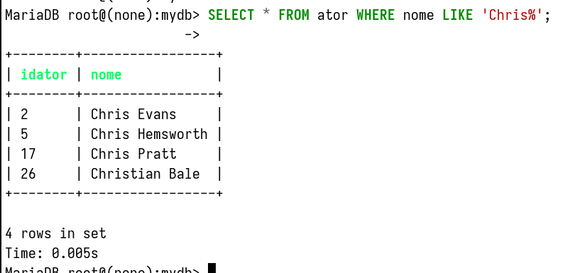
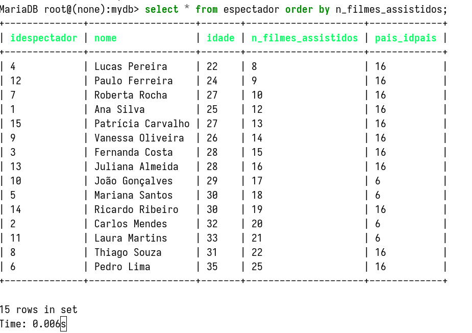

# ALUNOS: ALYSSON OLIVEIRA, KAIK COSTA, VICTOR BITENCOURT


# Requisitos mínimos do sistema (2ª etapa) 

## 1 banco de dados em funcionamento com os ajustes indicados na 1ª etapa do projeto 

- [X] No mínimo 8 tabelas (sem contar com as tabelas usadas para autenticação de usuários) 

- [X] Criação de banco, tabelas e demais objetos fiéis ao DER, além de script de povoamento 
    
- [X] As tabelas devem contemplar o uso de default, check, primary key e foreign key (sempre que necessário) em conformidade com os ajustes sinalizados na primeira etapa da entrega do trabalho. 

- [X] INSERT, no mínimo 15 registros em cada tabela (se possível). 

- [X] Um DELETE e um UPDATE em alguma tabela. 

```sql
DELETE FROM diretor WHERE nome LIKE 'Peter Jackson';
```

```sql
UPDATE espectador SET nome = 'Victor Hugo' WHERE idespectador = 15;
```

---

## A aplicação deve efetuar também as seguintes consultas separadamente:  

- [X] SELECT com LIKE. 

```sql
SELECT * FROM ator WHERE nome LIKE 'Chris%';
```



---

- [X] SELECT com order by. 

```sql
SELECT * FROM espectador ORDER BY n_filmes_assistidos;
```



---

- [ ] SELECT com GROUP BY E HAVING. 

---

- [ ] SELECT com JOIN com duas tabelas 

---

- [ ] SELECT com JOIN com três tabelas 

---

- [ ] SELECT com JOIN com quatro tabelas 

---

- [ ] SELECT com JOIN com no mínimo 3 tabelas, group by e having 

---

- [ ] SELECT com JOIN com no mínimo 3 tabelas, group by (diferente do item h) 

---

- [ ] SELECT com JOIN com no mínimo 2 tabelas, Where, group by e having (diferente do item h e i) 

