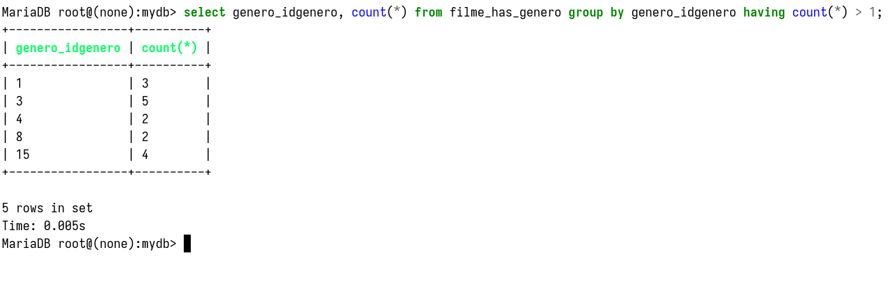

# ALUNOS: ALYSSON OLIVEIRA, KAIK COSTA, VICTOR BITENCOURT


# Requisitos mínimos do sistema (2ª etapa) 

## 1 banco de dados em funcionamento com os ajustes indicados na 1ª etapa do projeto 

- [X] No mínimo 8 tabelas (sem contar com as tabelas usadas para autenticação de usuários) 

- [X] Criação de banco, tabelas e demais objetos fiéis ao DER, além de script de povoamento 
    
- [X] As tabelas devem contemplar o uso de default, check, primary key e foreign key (sempre que necessário) em conformidade com os ajustes sinalizados na primeira etapa da entrega do trabalho. 

- [X] INSERT, no mínimo 15 registros em cada tabela (se possível). 

- [X] Um DELETE e um UPDATE em alguma tabela. 

```sql
DELETE FROM diretor WHERE nome LIKE 'Peter Jackson';
```

```sql
UPDATE espectador SET nome = 'Victor Hugo' WHERE idespectador = 15;
```

---

## A aplicação deve efetuar também as seguintes consultas separadamente:  

- [X] SELECT com LIKE. 

```sql
SELECT * FROM ator WHERE nome LIKE 'Chris%';
```


---

- [X] SELECT com order by. 

```sql
SELECT * FROM espectador ORDER BY n_filmes_assistidos;
```


---

- [ ] SELECT com GROUP BY E HAVING. 

```sql
SELECT genero_idgenero, count(*) FROM filme_has_genero 
GROUP BY genero_idgenero 
HAVING count(*) > 1;
```



---

- [ ] SELECT com JOIN com duas tabelas 
```sql
use mydb;
SELECT es.idespectador, es.nome, es.idade, av.nota, av.comentario
FROM espectador es INNER JOIN avaliacao av ON es.idespectador = av.espectador_idespectador
```


- [ ] SELECT com JOIN com três tabelas 
```sql
use mydb;
SELECT f.idfilme, f.nome, f.descricao, a.nome
FROM filme f
INNER JOIN elenco e ON f.idfilme = e.filme_idfilme
INNER JOIN ator a ON a.idator = e.ator_idator
```

- [ ] SELECT com JOIN com quatro tabelas 
```sql
USE mydb;
SELECT f.idfilme, f.nome, f.descricao,d.nome as diretor_principal,p.nome as produtora,r.nome as roteirista_principal
FROM filme f
INNER JOIN diretor d ON f.diretor_principal_iddiretor = d.iddiretor
INNER JOIN produtora p ON f.produtora_idprodutora = p.idprodutora
INNER JOIN roteirista r ON f.roteirista_principal_idroteirista = r.idroteirista
```

- [ ] SELECT com JOIN com no mínimo 3 tabelas, group by e having 
```sql
use mydb;
SELECT  f.nome,f.descricao, AVG(av.nota) as nota, count(p.nome) as quantidade_premios
FROM filme f
INNER JOIN avaliacao av on av.filme_idfilme = f.idfilme
INNER JOIN premio p on p.filme_idfilme = f.idfilme
GROUP BY f.nome
HAVING AVG(av.nota) > 8
```

- [ ] SELECT com JOIN com no mínimo 3 tabelas, group by (diferente do item h) 

---

- [ ] SELECT com JOIN com no mínimo 2 tabelas, Where, group by e having (diferente do item h e i) 

